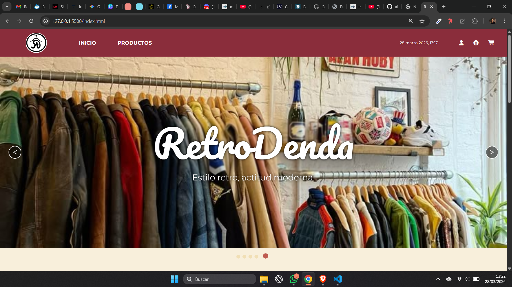

# 🛍️ RetroDenda - Tienda Online Retro

¡Bienvenido a **RetroDenda**! Un proyecto nacido de la pasión por lo clásico y el aprendizaje constante. Este es el resultado del trabajo en equipo de estudiantes del Bootcamp Fullstack de **Peñascal F5** (Bilbao).

## 📝 Descripción del Proyecto
RetroDenda es una plataforma de e-commerce con estética retro, desarrollada para poner en práctica nuestras habilidades en el desarrollo web. El objetivo principal fue integrar un frontend dinámico con un backend funcional, enfrentándonos a retos reales de comunicación de datos y trabajo colaborativo.

---

## 🚀 Instalación y Uso

Para ver la tienda en funcionamiento, necesitas poner en marcha tanto el **servidor** (datos) como la **interfaz** (cliente).

### 1. Preparar el Backend 🔌
Este proyecto utiliza un servidor de datos local.
1. Sigue las instrucciones de instalación en el [Repositorio del Backend](https://github.com/alvarezmarlen/backend-tienda-retrodenda).
2. Asegúrate de que el servidor esté corriendo en `http://localhost:8000`.

### 2. Ejecutar el Frontend 💻
Una vez que el backend esté encendido:
1. Clona este repositorio en tu máquina.
2. Abre el archivo `index.html` en tu navegador (recomendamos usar la extensión **Live Server** de VS Code).

---

## ✨ Características Principales
* **Animaciones integradas:** Experiencia visual fluida. 🎬
* **Gestión de Carrito:** Sistema funcional para añadir y gestionar productos. 🛒
* **Base de Datos Dinámica:** Uso de JSON y peticiones `fetch` para mostrar productos reales. 📦
* **Diseño Responsivo:** Navegación optimizada y carrusel de imágenes interactivo. 🖼️

---

## 🛠️ Tecnologías Utilizadas
* **Lenguajes:** HTML5, CSS3, JavaScript (Vanilla). 🏗️
* **Herramientas de Versiones:** Git & GitHub. 🐙
* **Productividad:** Trello (Metodología Ágil para organización de tareas). 📋

---

## 👥 Autores y Colaboradores
Este proyecto fue desarrollado de manera colaborativa por el equipo **Hilos I**:

* **Marlen Alvarez** - [GitHub](https://github.com/alvarezmarlen) (Desarrollo y mantenimiento del Fork)
* **Juan Carlos** - [GitHub](https://github.com/JuanCarlos0977)
* **Jorge Cereceda** - [GitHub](https://github.com/jorgecereceda)
* **Junior Gino** - [GitHub](https://github.com/juniorgino)
* **Ramiro Navas** - [GitHub](https://github.com/ramironavas)

---

### 📌 Próximos Pasos (Roadmap)
* [ ] Implementación de cambio de idioma (Multilenguaje). 🌍
* [ ] Mejoras en la estética y dinamismo del flujo de compra. ✨
* [ ] Robustecimiento del Backend. ⚙️